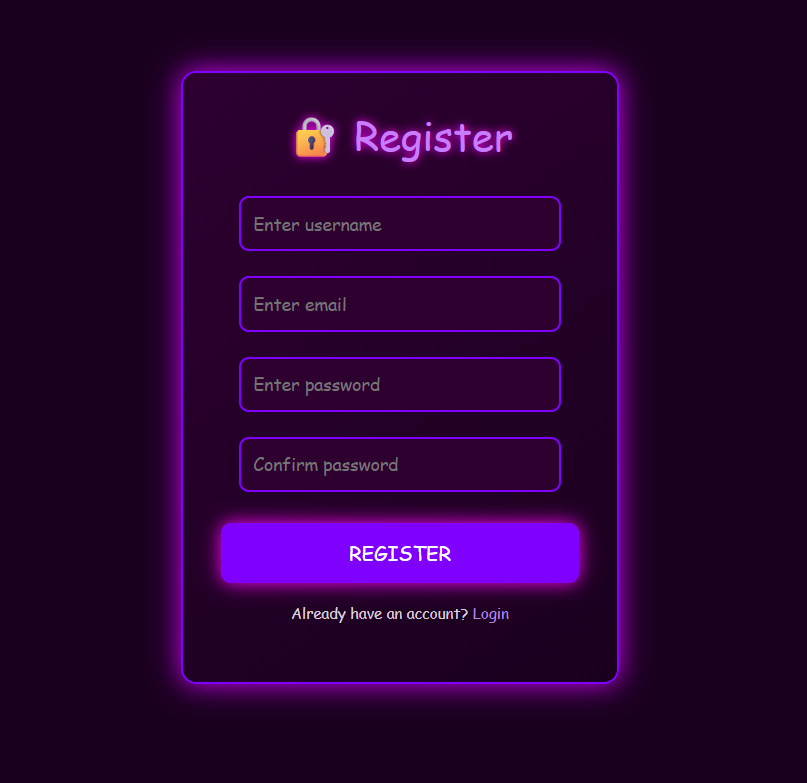
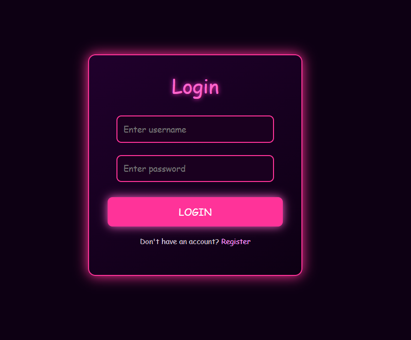
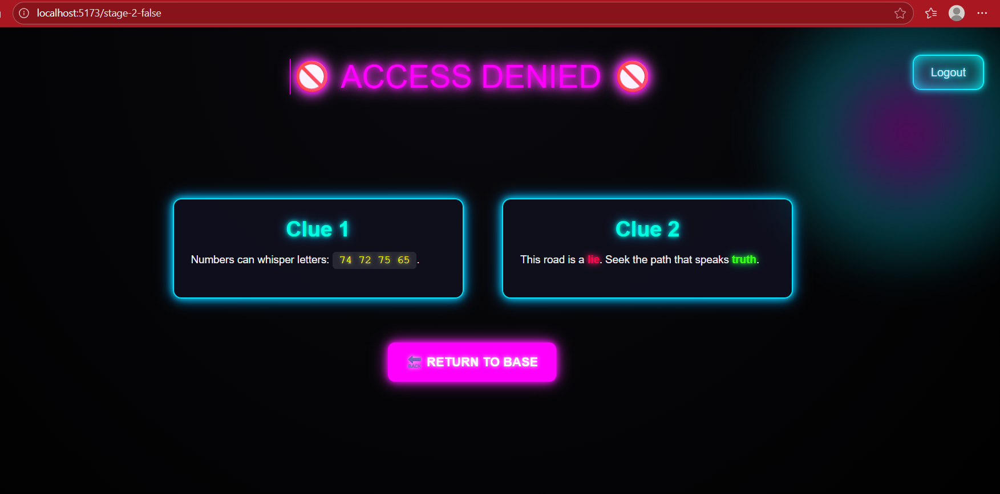
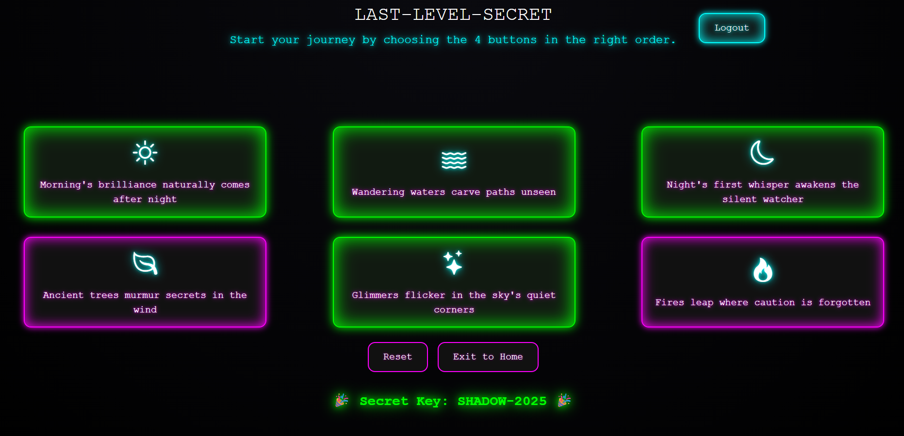

# Retro_Cyber

## Project Overview

It’s a retro puzzle adventure wrapped inside a secure authentication system.  
Secure Access – Users must Register/Login through a JWT-based authentication system, where tokens are stored safely in HttpOnly cookies.  
Three Puzzle Stages – Each stage unlocks a clue hidden in retro-themed challenges.  
Decode & Progress – Crack the puzzles step by step to advance.  
The Final Secret Key – Solve all three stages, and the ultimate reward is revealed: the hidden key.

## Technical Architecture

- **Frontend** – React + Retro-inspired CSS
- **Backend** – Django REST Framework with JWT authentication
- **Database** – SQLite (dev)
- **Authentication** – JWT Access & Refresh tokens stored in HttpOnly cookies

## Visual Documentation

## Demonstration Video

[GDG_Video_Demonstration](./assets/GDG_Video_Demonstration.mp4)

## Installation & Setup

### Backend Setup

**Clone repo**

    git clone https://github.com/sahana2006/Retro_Cyber.git
    cd Retro_Cyber

**Virtual Environments**

    python -m venv venv
    venv\Scripts\activate

    cd backend
    pip install -r requirements.txt

**Run migrations**

    python manage.py makemigrations
    python manage.py migrate

**Start server**

    python manage.py runserver

### Frontend Setup

    cd frontend
    npm install
    npm run dev

## Secret Key Implementation

The project is designed as a 3-stage puzzle where users must solve progressively harder challenges to finally uncover the secret key.

**Stage 1: Clues in the Source Code**

- Users are given four clues hidden under different cards.
- The clues collectively hint that the key is hidden in the source code.
- Inspecting the source reveals a hash code, which must be decoded from Base64.
- The decoded result instructs the player to press certain keys on the keyboard, which finally reveals the key for Stage 1.

**Stage 2: Hidden Path**

- It starts with a neon-styled "Access Denied" error page.
- Two clues guide the player:
- A hexadecimal string must be converted into readable text.
- The error itself is triggered by a wrong URL — correcting the URL path unlocks Stage 2.
- Once solved, the lock for Stage 2 opens, moving the player forward.

**Stage 3: The Button Maze**

- It presents a maze of six buttons.
- Only four buttons in the correct sequence will unlock the final key.
- Each button box contains a clue that helps deduce the right order.
- Successfully navigating the button maze reveals the final secret key

## Technology Stack

- **Frontend** - React + Retro-inspired CSS
- **Backend** - Django REST Framework (JWT, HttpOnly cookies)
- **Database** - SQLite
- **Auth** - JWT Access & Refresh tokens
